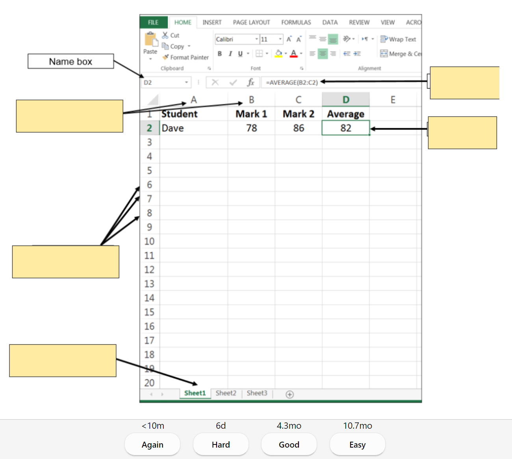
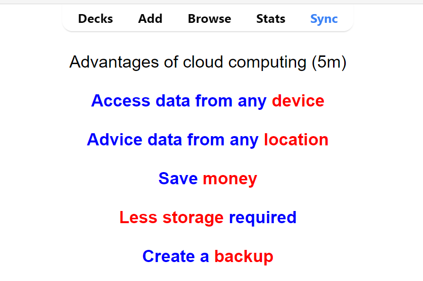
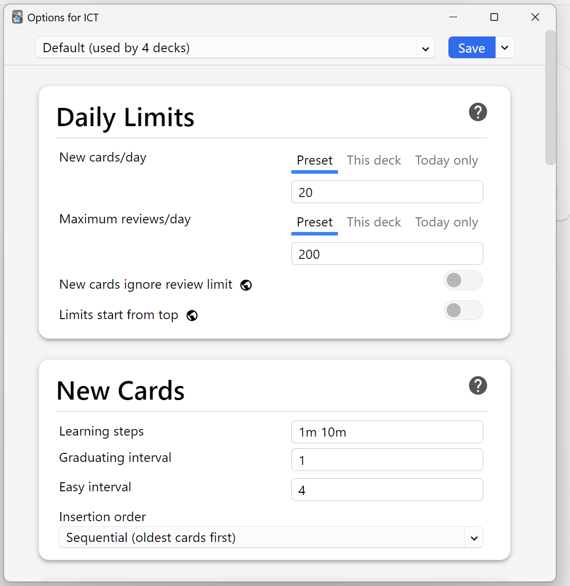

# MUF0051 - ICT 1

Information and Communication Technology Unit 1  
Anki flashcard and notes for final exam / quiz preparation  
Prepared for students under MUF0051 - ICT 1 during 2022/2023. Note that the current content for the final exam/quiz _may_ be subject to change.

Prepared by: Aaron Lam

---

  



This repository contains an ICT Anki deck package. Follow the steps below to add a new deck to your Anki application.

## How to Add a New Deck

1. **Download the Deck Package**
   - Go to the [Releases](https://github.com/Kyblue11/MUF0051/releases) section of this repository.
   - Download the latest `.apkg` file.

2. **Open Anki**
   - Launch the Anki application on your computer.

3. **Import the Deck**
   - In Anki, go to `File` > `Import...`.
   - Navigate to the location where you downloaded the `.apkg` file.
   - Select the `.apkg` file and click `Open`.

4. **Review the Deck**
   - The new deck should now appear in your list of decks.
   - Click on the deck name to start reviewing the cards.

## Contributing

If you would like to contribute to this project, please follow these steps:

1. **Fork the Repository**
   - Click the `Fork` button at the top right of this page to create a copy of this repository in your GitHub account.

2. **Clone the Repository**
   - Clone your forked repository to your local machine using:
     ```sh
     git clone https://github.com/Kyblue11/MUF0051.git
     ```

3. **Create a New Branch**
   - Create a new branch for your changes:
     ```sh
     git checkout -b new-feature
     ```

4. **Make Your Changes**
   - Add your new deck or make other changes to the repository.

5. **Commit Your Changes**
   - Commit your changes with a descriptive message:
     ```sh
     git commit -m "Add new ICT card to the deck"
     ```

6. **Push to Your Branch**
   - Push your changes to your forked repository:
     ```sh
     git push origin new-feature
     ```

7. **Create a Pull Request**
   - Go to the original repository on GitHub and create a pull request from your forked repository.
